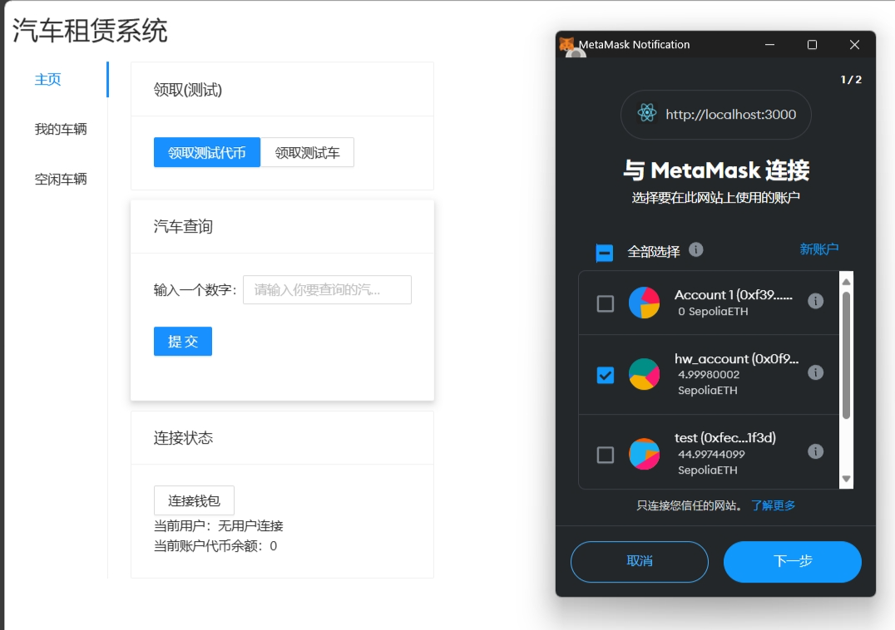
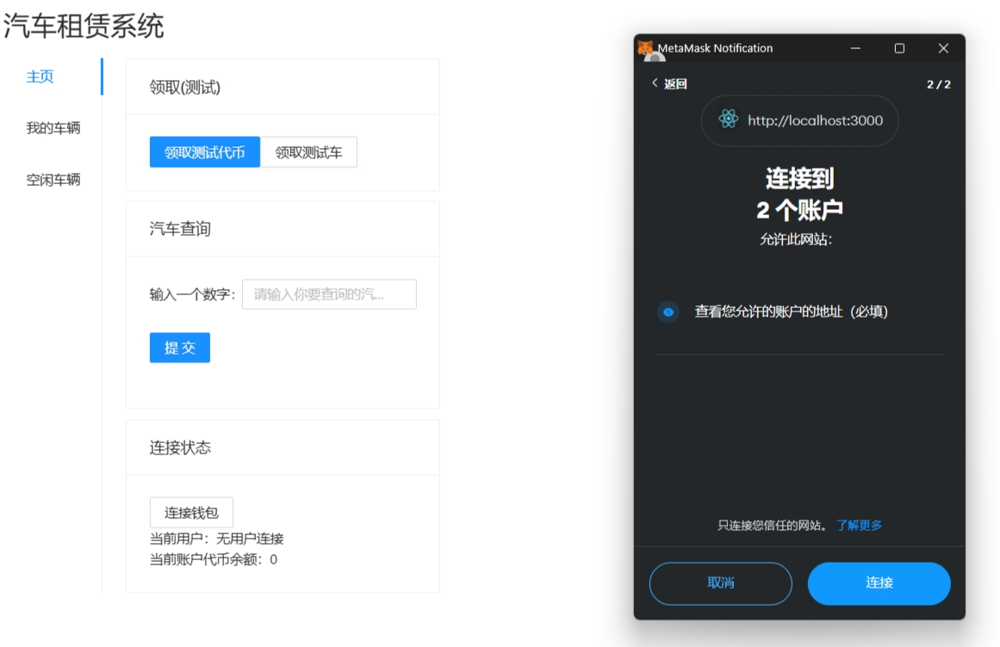

# 如何运行

补充如何完整运行你的应用。

1. 在本地启动ganache应用。

2. 在 `./contracts` 中安装需要的依赖，运行如下的命令：
    ```bash
    npm install
    ```
3. 在 `./contracts` 中编译合约，运行如下的命令：
    ```bash
    npx hardhat compile
    ```
4. 在 `./contracts` 中部署合约，运行如下的命令
    ```bash
    npx hardhat run ./scripts/deploy.ts --network ganache
    ```
    得到部署后的地址
    
5. 合约部署后在`./contracts/artifacts/contracts`中找到`BorrowYourCar.json`和`credits.json`，复制一份到`./frontend/utils/abis/`中，并且在同目录的`contract-addresses.json`文件中用部署后得到的地址替换原有的地址

6. 在 `./frontend` 中安装需要的依赖，运行如下的命令：
    ```bash
    npm install
    ```
7. 在 `./frontend` 中启动前端程序，运行如下的命令：
    ```bash
    npm run start
    ```

# 功能实现分析

1. 领取测试用的车辆和代币：用mint方法生成代币
2. 汽车查询: 可以输入一辆汽车的tokenId，然后得到汽车的拥有者，以及车辆被租借的状态。这里创建了一个cars的map，以车辆的token为索引找到对应的车辆，然后返回其拥有者和租借者
3. 账户状态: 可以实时当前账户的地址以及余额，以及可以选择断开当前账户的连接以建立新的连接。查询余额是调用了balanceOf方法，断开连接只需要将账户的account置为空，并且要将钱包设置为每次连接时都要请求`'wallet_requestPermissions'`
4. 我的车辆: 可以查看所有当前账户拥有的车辆。用一个carList的map来记录每个账户拥有的车辆，只需要返回当前账户的车辆列表即可
5. 空闲车辆: 可以查看当前所有连接者中未被租借的车辆。遍历得到carList中所有未被借出的车
6. 租借汽车：可以对空闲的汽车进行租借。租借时按照租借时间进行扣费

# 项目运行截图

## 领取测试代币和车辆
+ 首先选择一个空账户进行连接


+ 登入后分别领取代币和测试车，代币初始为1024


+ 查看车辆列表看到测试车


## 汽车查看
+ 将第二个账户接入(我们让第二个连接的账户作为我们使用的账户)



+ 此时我们查看空闲汽车列表可以看到之前的账户领取的汽车，而我们当前账户在未领取汽车时我的汽车为空


 

## 汽车租赁
+ 领取代币后用当前账号租赁之前账号领取的车辆，选择租赁的时长后进行确定，没有警告代表租赁成功

+ 尝试一下重复租赁。在前端修改代码，使我们租赁完汽车后不会立刻更新可用车的列表，此时我们租赁后得警告`The car has been borrowed`

+ 实际上我们在租完车后该车会从空闲车辆中被移除


## 汽车查询
+ 将刚才租出的车进行查询，得到的地址与租赁者和拥有者的地址一致
